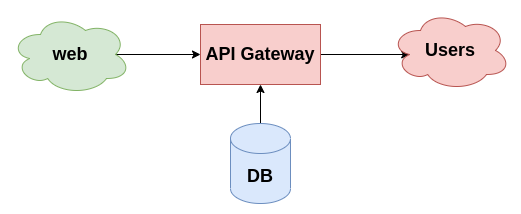
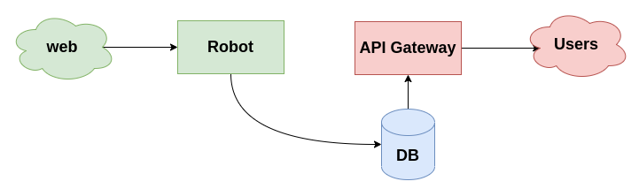
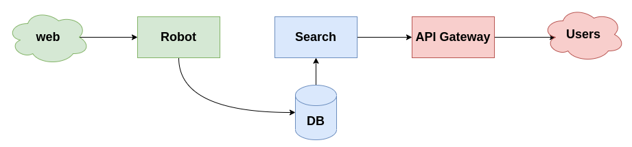
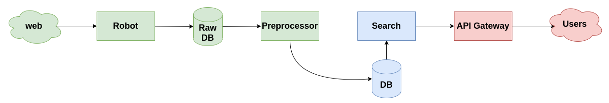
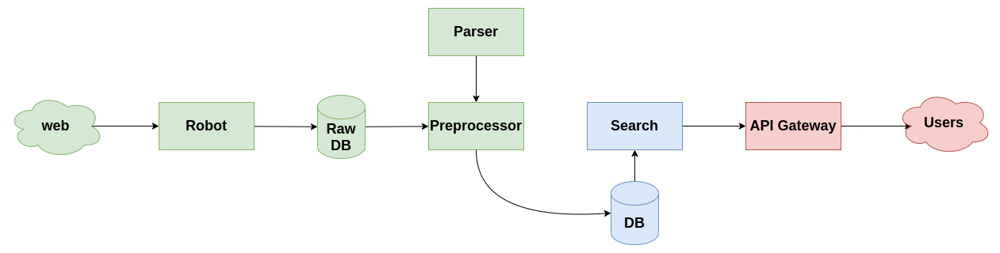
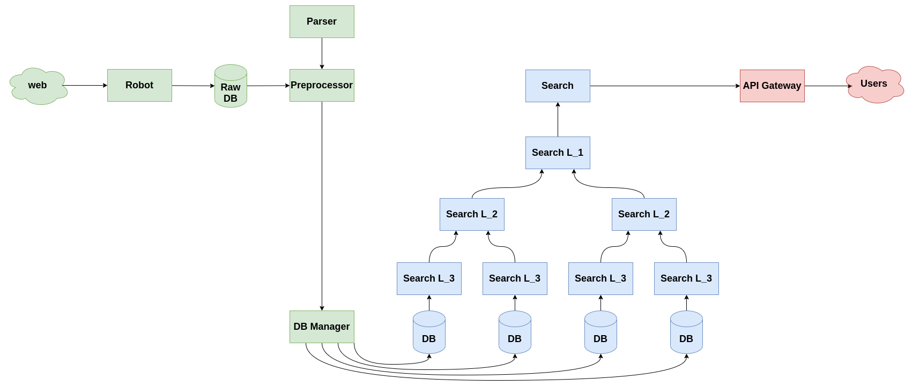

# HW 4

Здесь я предлагаю план развития поисковой системы по документам от монолита в сторону микросервисов.

## Монолит

Начинаем с монолита. В бэкэнде крутится одно единственное приложение, которое:
* само ходит по источникам информации и собирает документы
* само работает с базой данных
* само обрабатывает запросы пользователей

## Выносим робота

Первым делом можно разделить логику сбора документов и ответов на поисковые запросы пользователей. Робот может:
* обходить источники
* обрабатывать документы
* складывать документы в базу данных

А часть, которая на схеме обозначена "API Gateway":
* принимает запросы пользователя
* обрабатывает их
* делает поиск по базе данных
* формирует ответ для пользователя

## Выносим поиск

Далее можно разделить логику работы с пользовательскими запросами и непосредственно обработку запросов. Разные запросы могут приходить из разных источников:
* из приложения
* с веб сайта
* через внешнее API

Все эти запросы можно обрабатывать отдельно (в том числе разными микросервисами) а потом передавать их в поисковую систему, которая обработает эти запросы содержательно и сформирует ответ.

## Выносим обработку документов

Теперь можно сделать аналогичное разделение с дугой стороны. Можно разделить сбор документов и их обработку. Роботы, собирающие документы, могут просто складывать их в соответствующую базу данных, а затем отдельный сервис будет доставать документы, обрабатывать их и складывать в базу данных для обработанных документов.

## Выносим логику обработки

Затем можно вынести в отдельный сервис-парсер обработку документов. А препроцессору оставить лишь организаторскую работу:
* достать документ
* передать на обработку
* сложить в базу данных

## Иерархический поиск

Наконец, можно оптимизировать поиск, сделав его иерархическим. На нижнем уровне будут применяться какие-то очень простые фильтры, и наверх пойдут только подходящие документы. На втором уровне будут применяться более сложные фильтры, и наверх пойдут еще более релевантные документы. А в конце можно будет применить совсем тяжелые фильтры, которые было бы слишком дорого применять ко всем документам.

Такая систем потребует разделения базы данных на какие-то кластеры. И чтобы упростить работу сервису предобработки, можно ввести сервис, ответственный за распределение документов по кластерам.

И последнее, что можно сделать - выделить сервис, отвечающий за формирование найденных документов в ответ. Так можно будет разделить логику поиска и формирования ответа для пользователя.
